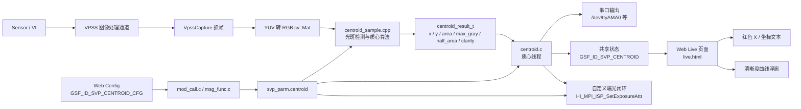
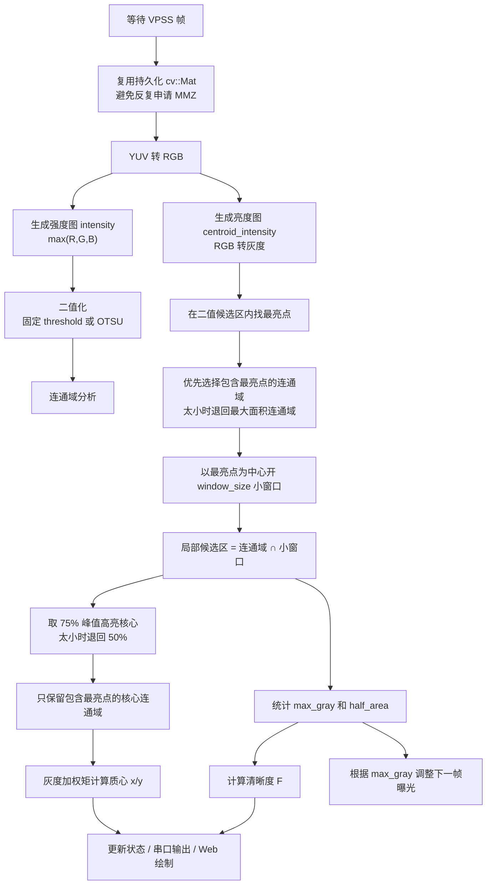

# HIVIEW 光斑质心提取功能说明

本文档记录 `HIVIEW-master` 当前已完成的所有质心提取相关改动，包括算法、配置、串口输出、Web 显示、清晰度曲线、自定义曝光控制、打包升级流程，以及各模块之间的数据流。

当前工程目录：

```text
D:\hisi\HIVIEW-master
```

WSL 中对应路径：

```bash
/mnt/d/hisi/HIVIEW-master
```

当前 16d 升级包输出路径：

```text
D:\hisi\HIVIEW-master\upg\cam16d.upg
```

## 功能总览

本次新增功能集成在 `svp.exe` 算法进程和 `webs.exe` Web 进程中，目标是从实时视频中提取光斑质心坐标，并同时通过串口和 Web 实时显示。

已完成的能力：

1. 从 HiSilicon VPSS 通道实时抓帧。
2. 使用 OpenCV 提取光斑最亮点和局部亮斑核心。
3. 以最亮点为中心开小窗口计算灰度加权质心，降低反光、光晕、拖尾和噪声造成的偏移。
4. 通过串口输出 `CENTROID,...` 文本结果。
5. 在 Web Live 页面显示质心坐标，并在视频画面上绘制红色 `X`。
6. 在 Web Live 页面显示清晰度函数随时间变化的半透明曲线浮窗。
7. 将所有质心相关参数迁移到独立的 `GSF_ID_SVP_CENTROID_CFG` 配置类。
8. 支持 Web 端实时修改阈值、小窗口尺寸、清晰度参数、浮窗尺寸、串口参数和曝光控制参数。
9. 支持关闭 ISP 自动曝光和自动增益后，由质心线程根据 `max_gray` 实现手动曝光闭环。
10. 修复 VPSS 抓帧时每帧申请 MMZ 导致 `mmz_userdev: ioctl_mmb_alloc failed` 的问题。
11. 修复 Web 配置接口中 `GSF_ID_SVP_CENTROID_CFG` 被误匹配到 `GSF_ID_SVP_CENTROID` 的问题。
12. 修复 Web 视频等比例显示或黑边导致红色 `X` 坐标偏移的问题。
13. 修改 16d 打包路径，升级包固定输出到工程自身的 `upg` 目录。

## 功能框图



## 逐帧处理流水线



## 主要修改文件

| 文件 | 改动说明 |
| --- | --- |
| `mod/svp/3516d/nnie/sample/centroid_sample.h` | 扩展质心检测结果，新增 `max_gray`、`half_area`、`clarity` 字段；算法接口新增 `window_size` 参数。 |
| `mod/svp/3516d/nnie/sample/centroid_sample.cpp` | 实现 VPSS 抓帧、MMZ 缓存复用、光斑二值化、最亮点优先、局部小窗口质心、高亮核心筛选和灰度矩计算。 |
| `mod/svp/3516d/centroid.c` | 实现质心线程、串口输出、状态缓存、清晰度计算、自定义曝光闭环、配置实时读取。 |
| `mod/svp/3516d/msg_func.c` | 增加 `GSF_ID_SVP_CENTROID` 状态读取接口和 `GSF_ID_SVP_CENTROID_CFG` 配置 GET/SET 接口，并对参数做范围保护。 |
| `mod/svp/3516d/svp.c` | 根据 `svp_parm.centroid.centroid_alg` 启停质心线程；如果配置已打开但线程未运行，会自动重试启动。 |
| `mod/svp/3516d/cfg.c` | 增加质心默认配置；支持把旧版本临时放在 `svp` 段的质心字段迁移到新的 `centroid` 段。 |
| `mod/svp/inc/sjb_svp.ih` | 扩展 JSON/IPC 结构，新增 `gsf_svp_centroid_t` 和 `gsf_svp_centroid_status_t` 相关字段。 |
| `mod/svp/inc/svp.h` | 增加 `GSF_ID_SVP_CENTROID` 和 `GSF_ID_SVP_CENTROID_CFG` 消息号。 |
| `mod/webs/src/mod_call.c` | 增加 Web 到 SVP 的配置映射；把配置 ID 匹配改为精确 `strcmp`，避免前缀误匹配。 |
| `mod/webs/www/w2ui/html/GSF_ID_SVP_CENTROID_CFG.html` | 新增独立质心配置页面，可 GET/SET 所有质心相关参数。 |
| `mod/webs/www/w2ui/html/sidebar-cfg.html` | 在 Web Config 侧边栏加入 `GSF_ID_SVP_CENTROID_CFG` 入口。 |
| `mod/webs/www/w2ui/html/live.html` | 在 Live 页面轮询质心状态，绘制红色 `X`、坐标文本、清晰度曲线浮窗和曝光状态。 |
| `ins.sh` | 16d 打包目录改为工程内 `upg/16d`，最终升级包复制到工程内 `upg/cam16d.upg`。 |

## 算法改动详解

### 1. 强度图和亮度图分离

光斑可能是白光，也可能是红、绿、蓝单色激光。如果直接把 RGB 转灰度，红光和蓝光可能因为灰度权重较低而被压弱，固定阈值下容易漏检。

因此算法使用两张图：

| 图像 | 生成方式 | 用途 |
| --- | --- | --- |
| `intensity` | `max(R, G, B)` | 用于光斑候选检测、`max_gray` 统计和曝光控制。 |
| `centroid_intensity` | RGB 转灰度 | 用于寻找视觉亮度主峰和计算质心，减少红色光晕或反射对质心的拉偏。 |

这样既保留了单色激光检测能力，又避免把某些红色反光区域当成主光斑中心。

### 2. 二值化和候选区域

配置字段 `threshold` 控制二值化：

```text
1~254：使用固定阈值
其它值：使用 OTSU 自动阈值
```

二值化后通过 `connectedComponentsWithStats()` 做连通域分析。早期版本倾向选择面积最大的亮斑区域，但现场里可能出现大面积光晕、反光、拖尾或噪声，这会导致选错区域。

当前逻辑改为：

1. 在二值候选区内寻找亮度图的最亮点。
2. 优先选择“包含最亮点”的连通域。
3. 如果该区域面积低于 `min_area`，认为它可能是孤立热噪声，再退回选择面积最大的有效连通域。

### 3. 最亮点小窗口

用户提出“提取到最亮的点后，开一个小窗计算，避免大窗口将其他噪声计入计算”。当前已实现该逻辑。

配置字段：

```json
"window_size": 64
```

算法流程：

1. 找到当前帧最亮点 `core_max_loc`。
2. 以该点为中心创建 `window_size x window_size` 局部窗口。
3. 计算区域限定为：

```text
local_spot_mask = 最亮点所在连通域 ∩ 局部窗口
```

这样远处反光、光晕、拖尾或噪声即使在二值图中存在，也不会参与质心矩计算。

建议调参：

| 场景 | 建议 |
| --- | --- |
| 光斑很小，周围噪声多 | 将 `window_size` 调小，例如 `32` 或 `48`。 |
| 光斑离焦较大 | 将 `window_size` 调大，例如 `96` 或 `128`。 |
| 质心仍被远处反光拉偏 | 先减小 `window_size`，再适当提高 `threshold`。 |
| 质心抖动明显 | 适当增大 `window_size`，避免只看到极小饱和核心。 |

### 4. 高亮核心筛选

在局部窗口内，算法不会直接对整个窗口求矩，而是进一步锁定主峰：

1. 找局部窗口内亮度最大值。
2. 取 `75%` 峰值以上的高亮核心。
3. 如果核心像素太少，退回取 `50%` 峰值以上区域。
4. 对核心区域做连通域分析，只保留包含最亮点的核心连通域。
5. 用该核心区域的灰度值做加权矩计算：

```text
x = m10 / m00
y = m01 / m00
```

这可以同时抑制以下干扰：

```text
远处孤立亮点
红色光晕
镜头反射
光斑拖尾
大面积低亮背景
```

### 5. `max_gray`、`half_area` 和 `area`

当前版本中：

| 字段 | 当前含义 |
| --- | --- |
| `max_gray` | 局部候选区内 `intensity` 的最大灰度值。 |
| `half_area` | 局部候选区内灰度值超过 `max_gray * 0.5` 的像元数量。 |
| `area` | 局部窗口内参与候选的光斑像素数量。 |

早期 `area` 更接近完整二值连通域面积；现在为了避免大区域噪声影响，它更接近“最亮点附近参与计算的有效面积”。

### 6. MMZ 内存复用

早期抓帧转换时，如果每一帧都传入新的临时 `cv::Mat`，底层 YUV 转 RGB 会不断申请新的 MMZ 缓冲，最终出现：

```text
mmz_userdev: ioctl_mmb_alloc failed
```

当前版本使用模块级持久化对象：

```cpp
static cv::Mat s_image;
```

分辨率不变时复用同一块缓冲，避免长时间运行后耗尽 MMZ。

## 串口输出

默认输出格式：

```text
CENTROID,valid,chn,x,y,width,height,area,pts
```

示例：

```text
CENTROID,1,1,1650.33,419.97,1920,1080,47372,53648630
```

字段说明：

| 字段 | 含义 |
| --- | --- |
| `CENTROID` | 固定帧头。 |
| `valid` | `1` 表示检测到有效光斑，`0` 表示未检测到。 |
| `chn` | VPSS 通道号。 |
| `x` | 质心横坐标，单位像素，图像左上角为原点。 |
| `y` | 质心纵坐标，单位像素，图像左上角为原点。 |
| `width` | 算法处理图像宽度。 |
| `height` | 算法处理图像高度。 |
| `area` | 局部窗口内有效光斑面积。 |
| `pts` | VPSS 帧时间戳。 |

默认串口参数：

```text
设备：/dev/ttyAMA0
波特率：115200
格式：8N1
```

如果需要输出未检测到光斑的帧，可设置：

```json
"print_no_spot": 1
```

未检测到时输出类似：

```text
CENTROID,0,1,-1,-1,1920,1080,0,pts
```

## Web 显示改动

### 1. Live 页面显示坐标和红色 `X`

`live.html` 会轮询：

```text
/config?id=GSF_ID_SVP_CENTROID&args=G0C0S0
```

当 `status.valid == 1` 时：

1. 左上角显示 `x`、`y`、`area`、`clarity`、曝光状态和图像尺寸。
2. 在视频画面对应坐标绘制红色 `X`。

### 2. 修正视频黑边导致的坐标偏移

浏览器显示视频时经常使用等比例缩放，画面周围可能出现黑边。早期版本直接使用：

```text
drawX = x * canvas.width / srcW
drawY = y * canvas.height / srcH
```

如果视频实际内容没有铺满整个 canvas，红色 `X` 就会偏移。

当前版本先计算真实视频显示区域：

```text
videoRect = 视频内容在 canvas 内的实际区域
```

再映射坐标：

```text
drawX = videoRect.x + x * videoRect.w / srcW
drawY = videoRect.y + y * videoRect.h / srcH
```

这样即使窗口缩放或出现黑边，红色 `X` 仍然对应算法坐标。

### 3. 清晰度曲线浮窗

Live 页面右上角新增半透明浮动窗口，用于显示清晰度随时间变化。

清晰度函数：

```text
F = max_gray / clarity_gain / clarity_exposure / half_area
```

含义：

| 项 | 含义 |
| --- | --- |
| `max_gray` | 当前局部光斑最大灰度。 |
| `clarity_gain` | 用户设定的增益归一化值。 |
| `clarity_exposure` | 用户设定的曝光归一化值。 |
| `half_area` | 超过当前最大灰度 50% 的像元数量。 |

曲线窗口默认显示最近 `10s` 的历史数据。为了避免浏览器轮询重复采样同一帧，Web 端使用 `update_ms` 判断状态是否是新帧，重复状态不会再次加入曲线。

### 4. 清晰度浮窗尺寸可配置

新增配置：

```json
"clarity_window_w": 360,
"clarity_window_h": 150
```

范围保护：

| 参数 | 最小值 | 最大值 |
| --- | --- | --- |
| `clarity_window_w` | `180` | `960` |
| `clarity_window_h` | `90` | `540` |

Web 端还会根据当前视频 canvas 尺寸再限制一次，避免浮窗超出画面。

## 独立配置类

质心提取相关配置已经从通用 `GSF_ID_SVP_CFG` 中迁移到独立配置类：

```text
GSF_ID_SVP_CENTROID_CFG
```

这样做的原因：

1. 质心参数数量已经很多，不适合继续塞在通用 SVP 配置里。
2. Web 页面可以单独维护质心参数，避免影响 YOLO、LPR 等其它算法开关。
3. 后续继续增加 ROI、滤波、曝光策略等参数时，结构更清晰。

### 配置接口

读取配置：

```text
/config?id=GSF_ID_SVP_CENTROID_CFG&args=G0C0S0
```

保存配置：

```text
/config?id=GSF_ID_SVP_CENTROID_CFG&args=G1C0S0
```

Web 页面入口：

```text
Config -> GSF_ID_SVP_CENTROID_CFG
```

### 前缀匹配修复

`mod_call.c` 原先使用前缀匹配配置 ID，导致：

```text
GSF_ID_SVP_CENTROID_CFG
```

可能先命中：

```text
GSF_ID_SVP_CENTROID
```

结果是 SET 请求被发到只读状态接口，看起来没有报错，但配置不会保存。

当前改为精确匹配：

```c
strcmp(sjb_maps[i].str, str)
```

确保 `GSF_ID_SVP_CENTROID_CFG` 能正确进入配置接口。

## 配置参数

当前 `GSF_ID_SVP_CENTROID_CFG` 默认配置如下：

```json
{
  "centroid_alg": 0,
  "vpss_grp": 0,
  "vpss_chn": 1,
  "threshold": 220,
  "min_area": 4,
  "window_size": 64,
  "interval_ms": 100,
  "baudrate": 115200,
  "print_no_spot": 0,
  "clarity_gain": 1.0,
  "clarity_exposure": 1.0,
  "clarity_window_w": 360,
  "clarity_window_h": 150,
  "ae_enable": 0,
  "ae_isp_pipe": 0,
  "ae_saturation": 255,
  "ae_target_ratio": 0.8,
  "ae_min_exp_us": 100,
  "ae_max_exp_us": 33333,
  "ae_init_exp_us": 0,
  "ae_manual_gain": 1024,
  "uart_dev": "/dev/ttyAMA0"
}
```

参数说明：

| 参数 | 默认值 | 说明 |
| --- | --- | --- |
| `centroid_alg` | `0` | 质心算法开关，`0` 关闭，`1` 开启。 |
| `vpss_grp` | `0` | 抓帧使用的 VPSS 组号。 |
| `vpss_chn` | `1` | 抓帧使用的 VPSS 通道号。若 Web 画面和算法坐标明显不一致，优先检查该值是否与预览通道匹配。 |
| `threshold` | `220` | 光斑二值化阈值，`1~254` 为固定阈值，其它值使用 OTSU。 |
| `min_area` | `4` | 最小亮斑面积，小于该值的候选区认为是噪声。 |
| `window_size` | `64` | 以最亮点为中心的局部质心计算窗口边长，单位像素。 |
| `interval_ms` | `100` | 质心线程处理和串口输出间隔，单位毫秒。 |
| `baudrate` | `115200` | 串口波特率。 |
| `print_no_spot` | `0` | 是否输出未检测到光斑的帧。 |
| `clarity_gain` | `1.0` | 清晰度函数分母中的增益设定值，必须大于 0。 |
| `clarity_exposure` | `1.0` | 清晰度函数分母中的曝光时间设定值，必须大于 0。 |
| `clarity_window_w` | `360` | Web 清晰度曲线浮窗宽度，单位像素。 |
| `clarity_window_h` | `150` | Web 清晰度曲线浮窗高度，单位像素。 |
| `ae_enable` | `0` | ISP 自动曝光开关。`0` 表示关闭 ISP 自动曝光/自动增益，并启用质心线程的手动曝光闭环；`1` 表示不接管曝光并恢复 ISP 原配置。 |
| `ae_isp_pipe` | `0` | 需要控制的 ISP Pipe 号。单 Sensor 场景通常为 `0`。 |
| `ae_saturation` | `255` | 最大灰度饱和值。8bit 图像通常为 `255`。 |
| `ae_target_ratio` | `0.8` | 目标最大灰度比例。默认目标为 `255 * 0.8 = 204`。 |
| `ae_min_exp_us` | `100` | 自定义曝光允许的最小曝光时间，单位微秒。 |
| `ae_max_exp_us` | `33333` | 自定义曝光允许的最大曝光时间，单位微秒。 |
| `ae_init_exp_us` | `0` | 自定义曝光启动时的初始曝光时间。`0` 表示读取 ISP 当前曝光作为起点。 |
| `ae_manual_gain` | `1024` | 固定手动增益，HiSilicon 22.10 定点格式，`1024` 表示 `1x`。 |
| `uart_dev` | `/dev/ttyAMA0` | 板端串口设备。 |

## 自定义曝光控制

用户要求关闭自动曝光、关闭自动增益，并在 `ae_enable=0` 时按最大灰度实现手动曝光控制。当前实现如下。

### 1. 启动接管

当 `ae_enable=0` 时，质心线程会：

1. 读取并保存 ISP 原始曝光配置。
2. 将 ISP 曝光模式切到手动。
3. 将 `ExpTime`、`AGain`、`DGain`、`ISPDGain` 全部设置为手动。
4. 只自动调整曝光时间，增益固定为 `ae_manual_gain`。

当 `ae_enable=1` 时，质心线程不再接管曝光，并尽量恢复之前保存的 ISP 曝光配置。

### 2. 控制目标

目标最大灰度：

```text
target_gray = ae_saturation * ae_target_ratio
```

默认：

```text
target_gray = 255 * 0.8 = 204
```

### 3. 调节逻辑

```text
max_gray >= ae_saturation:
  已经饱和，曝光时间先减半。

max_gray > target_gray:
  按 target_gray / max_gray 的比例降低曝光。

max_gray < target_gray:
  按 target_gray / max_gray 的比例增加曝光，但单帧最多增加 2 倍。

max_gray 在目标附近 3% 死区内:
  保持当前曝光，避免来回抖动。
```

所有曝光时间都会限制在：

```text
ae_min_exp_us ~ ae_max_exp_us
```

Live 页面会显示曝光状态：

```text
exp=1600us, target=204, ae=down
```

其中：

| 字段 | 含义 |
| --- | --- |
| `exp` | 当前写入 ISP 的手动曝光时间。 |
| `target` | 当前目标最大灰度。 |
| `ae=down` | 本帧亮度偏高，下一帧降低曝光。 |
| `ae=up` | 本帧亮度偏低，下一帧提高曝光。 |
| `ae=hold` | 当前位于死区内，曝光保持不变。 |

## 状态接口

`GSF_ID_SVP_CENTROID` 是只读状态接口，Web Live 页面通过它获取最新结果。

主要状态字段：

| 字段 | 含义 |
| --- | --- |
| `running` | 质心线程是否正在运行。 |
| `valid` | 当前结果是否有效。 |
| `chn` | 当前结果对应的 VPSS 通道。 |
| `w` / `h` | 算法处理图像宽高。 |
| `x` / `y` | 质心坐标。 |
| `area` | 局部窗口内有效光斑面积。 |
| `max_gray` | 当前局部最大灰度。 |
| `half_area` | 超过半峰值的像元数量。 |
| `clarity` | 清晰度函数结果。 |
| `clarity_gain` / `clarity_exposure` | 本次清晰度计算使用的归一化参数。 |
| `clarity_window_w` / `clarity_window_h` | Web 清晰度曲线浮窗尺寸。 |
| `ae_enabled` | 当前是否由质心线程接管曝光。 |
| `ae_exp_us` | 当前手动曝光时间。 |
| `ae_target_exp_us` | 根据当前亮度计算出的目标曝光时间。 |
| `ae_adjust` | 曝光调节方向，`-1` 降，`0` 保持，`1` 升。 |
| `ae_saturation` | 当前使用的饱和灰度阈值。 |
| `ae_target_gray` | 当前目标最大灰度。 |
| `ae_last_ret` | 最近一次写 ISP 曝光接口的返回值。 |
| `pts` | VPSS 帧时间戳。 |
| `update_ms` | 状态更新时间，Web 用它判断是否为新样本。 |
| `age_ms` | Web 查询时状态距离当前的时间差。 |

## 编译与打包

进入工程：

```bash
cd /mnt/d/hisi/HIVIEW-master
```

加载 3516d 编译环境：

```bash
source build/3516d
```

完整编译：

```bash
make
```

仅重编 SVP：

```bash
make -C mod/svp DEPS=
```

修改 Web 接口或页面后，需要重编 Web：

```bash
make -C mod/webs DEPS=
```

如果新增了 IPC/JSON 结构字段，建议强制清理后重编 SVP 和 Web，避免结构体大小不一致：

```bash
make -C mod/svp clean
make -C mod/svp DEPS=
make -C mod/webs clean
make -C mod/webs DEPS=
```

打包 16d 升级包：

```bash
./ins.sh 16d
```

输出：

```text
D:\hisi\HIVIEW-master\upg\cam16d.upg
```

## 升级到板端

电脑和开发板需在同一网段。例如：

```text
电脑:   192.168.0.1
开发板: 192.168.0.2
```

确认网络：

```bash
ping 192.168.0.2
```

浏览器打开：

```text
http://192.168.0.2
```

进入升级页面，上传：

```text
D:\hisi\HIVIEW-master\upg\cam16d.upg
```

因为本功能同时修改了 `svp.exe`、`webs.exe`、Web 页面、配置结构和升级包内容，建议使用完整 `.upg` 升级，不要只替换单个文件。

升级完成后建议重启开发板。

## 启用和调试

### 1. 开启质心算法

进入：

```text
Config -> GSF_ID_SVP_CENTROID_CFG
```

点击 `GET`，修改：

```json
"centroid_alg": 1
```

点击 `SET`。

### 2. 查看 Web 坐标

进入：

```text
Live
```

如果检测到光斑，会看到：

```text
CENTROID: x=..., y=..., area=..., clarity=..., exp=..., target=..., ae=..., size=...
```

视频中会绘制红色 `X`。

### 3. 查看串口输出

PC 端使用串口助手、MobaXterm、Xshell、PuTTY 等打开对应 USB-TTL 串口。

默认：

```text
115200 8N1
```

如果看不到输出，先在板端测试：

```bash
echo "CENTROID_TEST" > /dev/ttyAMA0
```

如果 PC 仍看不到，检查：

```text
串口设备名是否正确
TX/RX 是否交叉
GND 是否共地
波特率是否 115200
USB-TTL 是否接到正确串口
```

查看板端串口设备：

```bash
ls -l /dev/ttyAMA* /dev/ttyS* /dev/ttyUSB* /dev/usbtty* 2>/dev/null
```

如果实际串口不是 `/dev/ttyAMA0`，修改：

```json
"uart_dev": "/dev/实际串口设备"
```

## 常见问题

### 1. `centroid_alg=1` 后算法没有启动

检查：

```bash
ps | grep svp
```

当前 `svp.c` 已增加重试逻辑：如果 `centroid_alg` 已经是 `1` 但线程没有运行，会继续尝试启动。常见原因是刚开机时 VPSS 通道尚未 ready，等待一会儿或重启板端通常可恢复。

### 2. Web 上红色 `X` 不在光斑中心

优先检查：

1. `vpss_chn` 是否和 Web 预览通道一致。
2. `window_size` 是否过大，导致反光进入局部窗口。
3. `threshold` 是否过低，导致大面积光晕进入候选区。
4. 当前光斑是否已经严重饱和，饱和平顶会降低质心精度。

建议尝试：

```json
"window_size": 48
```

或：

```json
"threshold": 240
```

### 3. 画面有光斑但清晰度曲线不更新

当前 Web 端只在 `update_ms` 变化时加入新样本。如果算法线程没有新结果，曲线不会重复塞入相同数据。

检查：

1. `centroid_alg` 是否为 `1`。
2. `valid` 是否为 `1`。
3. `threshold` 是否过高导致没有有效光斑。
4. `vpss_grp` / `vpss_chn` 是否能抓到帧。

### 4. 清晰度曲线窗口太大或太小

修改：

```json
"clarity_window_w": 480,
"clarity_window_h": 220
```

点击 `SET` 后下一轮状态刷新即可生效。Web 端会自动限制窗口不超出视频区域。

### 5. 仍然出现 MMZ 分配失败

当前版本已复用 `s_image`，避免每帧申请 MMZ。如果板端已经被旧进程耗尽过 MMZ，升级后建议重启开发板，清理旧状态。

### 6. 配置 SET 后再 GET 没变化

该问题之前由 `GSF_ID_SVP_CENTROID_CFG` 前缀误匹配导致。当前 `mod_call.c` 已改为精确匹配。

如果仍出现，检查浏览器请求是否为：

```text
/config?id=GSF_ID_SVP_CENTROID_CFG&args=G1C0S0
```

### 7. 自动曝光仍然过亮

确认：

```json
"ae_enable": 0,
"ae_target_ratio": 0.8,
"ae_saturation": 255
```

如果希望更暗，可以降低目标比例，例如：

```json
"ae_target_ratio": 0.7
```

如果曝光下降太慢，可降低 `ae_max_exp_us` 或设置更小的初始曝光 `ae_init_exp_us`。

## 推荐现场参数组合

普通小光斑：

```json
{
  "threshold": 220,
  "min_area": 4,
  "window_size": 64,
  "ae_enable": 0,
  "ae_target_ratio": 0.8
}
```

噪声或反光较多：

```json
{
  "threshold": 240,
  "min_area": 8,
  "window_size": 48
}
```

离焦大光斑：

```json
{
  "threshold": 200,
  "min_area": 20,
  "window_size": 128
}
```

更大的清晰度曲线窗口：

```json
{
  "clarity_window_w": 520,
  "clarity_window_h": 240
}
```

## 当前交付物

已生成的 16d 升级包：

```text
D:\hisi\HIVIEW-master\upg\cam16d.upg
```

其中包含：

```text
bin/svp.exe
bin/webs.exe
www/w2ui/html/live.html
www/w2ui/html/GSF_ID_SVP_CENTROID_CFG.html
www/w2ui/html/sidebar-cfg.html
其它原工程运行文件、库、配置、模型和安装脚本
```
